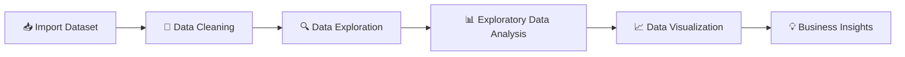

# 🎬 Netflix Data Analysis using Python

### 📊 Exploratory Data Analysis • Data Visualization • Business Intelligence


<br>


---

### ⭐ Analyzing Netflix's Global Content Library through Data Analytics

</div>

---

# 📖 Project Overview

This project performs **Exploratory Data Analysis (EDA)** on the **Netflix Movies & TV Shows Dataset** using Python.

The notebook explores Netflix's content catalog to identify patterns in **movies, TV shows, release trends, ratings, countries, genres, and durations**. By applying data cleaning, visualization, and statistical analysis techniques, the project extracts meaningful insights that help understand Netflix's content strategy and audience preferences.

---

# 🚀 Project Workflow



---

# 📸 Dashboard Preview

> Replace these images with screenshots from your notebook.

| Netflix Dashboard | Content Distribution |
|:-----------------:|:--------------------:|
|  |  |

| Release Trend | Genre Analysis |
|:-------------:|:--------------:|
|  |  |

---

# 📂 Repository Structure

```text
Netflix-Data-Analysis/
│
├── 📓 netflix_analysis.ipynb
├── 📄 netflix_titles.csv
├── 📄 README.md
│
└── 📁 assets
      ├── dashboard.png
      ├── content_type.png
      ├── release_trend.png
      └── genre_analysis.png
```

---

# 🛠️ Tech Stack

| Technology | Purpose |
|------------|---------|
| 🐍 Python | Programming Language |
| 🐼 Pandas | Data Cleaning & Analysis |
| 🔢 NumPy | Numerical Computing |
| 📊 Matplotlib | Data Visualization |
| 🎨 Seaborn | Statistical Visualization |
| 📓 Jupyter Notebook | Development Environment |

---

# ✨ Key Features

- ✅ Data Cleaning & Preprocessing
- ✅ Exploratory Data Analysis (EDA)
- ✅ Movies vs TV Shows Comparison
- ✅ Country-wise Content Analysis
- ✅ Release Year Trend Analysis
- ✅ Genre Analysis
- ✅ Ratings Analysis
- ✅ Duration Analysis
- ✅ Interactive Visualizations
- ✅ Business Insights

---

# 📈 Analysis Performed

<details>

<summary><b>📊 Click to Expand</b></summary>

### ✔ Data Cleaning

- Removed missing values
- Checked duplicates
- Formatted date columns

### ✔ Exploratory Analysis

- Movies vs TV Shows
- Release Year Distribution
- Country-wise Content
- Genre Distribution
- Rating Categories
- Duration Analysis

### ✔ Visualization

- Count Plots
- Bar Charts
- Heatmaps
- Pie Charts
- Histograms

### ✔ Business Insights

- Content growth over time
- Popular genres
- Most active production countries
- Rating distribution
- Netflix catalog trends

</details>

---

# 📊 Dataset Features

| Feature | Description |
|----------|-------------|
| 🎬 Type | Movie / TV Show |
| 📝 Title | Content Name |
| 🌍 Country | Production Country |
| 📅 Release Year | Year Released |
| ⭐ Rating | Audience Rating |
| 🎭 Genre | Category |
| ⏱ Duration | Runtime / Seasons |
| 🎥 Director | Director Name |
| 👥 Cast | Actors |

---

# 📚 Libraries Used

```python
import pandas as pd
import numpy as np
import matplotlib.pyplot as plt
import seaborn as sns
```

---

# 📌 Key Insights

| Analysis | Observation |
|----------|-------------|
| 🎬 Content Type | Movies dominate the Netflix catalog. |
| 📈 Growth | Significant increase in content after 2015. |
| 🌍 Countries | A few countries contribute the majority of titles. |
| 🎭 Genres | Drama and International content are among the most common categories. |
| ⭐ Ratings | TV-MA is one of the most frequent content ratings. |

---

# 🎯 Skills Demonstrated

Python

🟥🟥🟥🟥🟥 100%

Pandas

🟥🟥🟥🟥🟥 100%

EDA

🟥🟥🟥🟥🟥 100%

Visualization

🟥🟥🟥🟥🟥 100%

Business Analytics

🟥🟥🟥🟥⬜ 90%

---

# 🚀 Future Improvements

- 📊 Interactive Plotly Dashboard
- 🌐 Streamlit Web Application
- 🤖 Content Recommendation System
- 🎯 Machine Learning for Genre Prediction
- 📈 Power BI Dashboard

---

# 📌 Project Status

```text
Dataset Cleaning      ███████████████████ 100%

EDA                   ███████████████████ 100%

Visualization         ███████████████████ 100%

Insights              ███████████████████ 100%

Documentation         ███████████████████ 100%
```

---

# 🤝 Connect With Me

<div align="center">

### ❤️ Thank You for Visiting!
👨‍💻 Mukul Kumar Data Analytics Enthusiast

📞 Phone: 9315005376 | 📧 Email: mukulpal2004@gmail.com

⭐ If this project helped you, consider giving it a star! ⭐


Made with 🐍 Python • 🐼 Pandas • 📊 Matplotlib • 🎨 Seaborn

